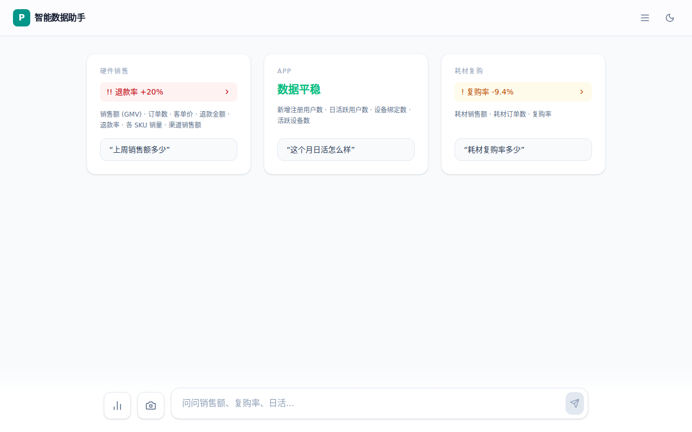
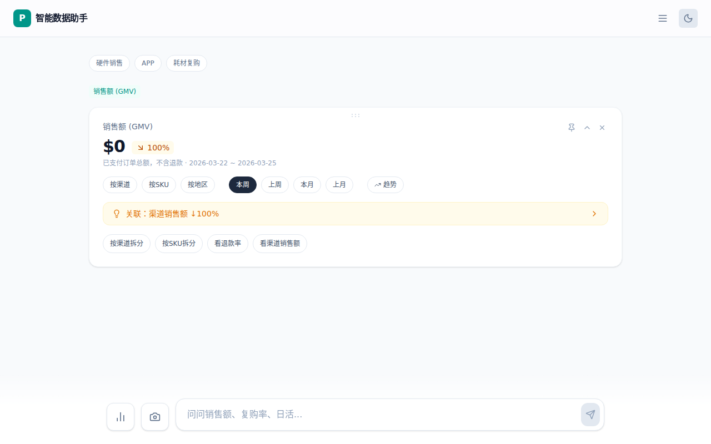
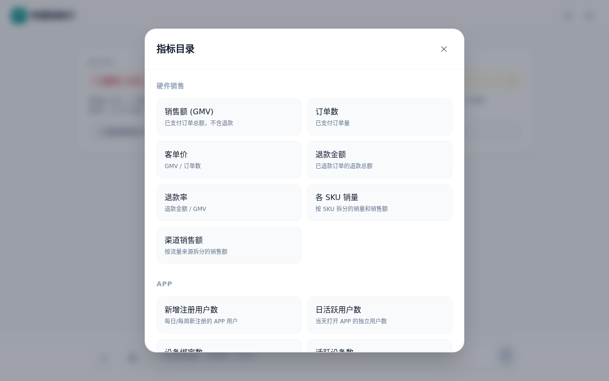
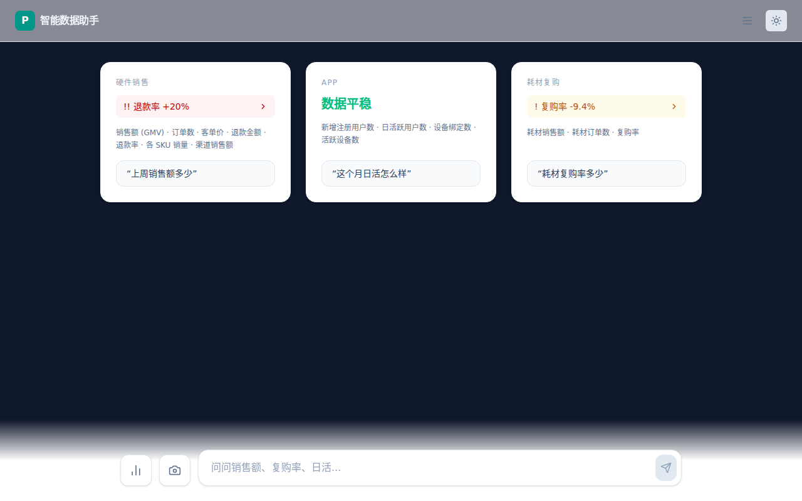

# AI 智能数据助手

  运营团队每天要花 10 分钟翻各种后台，看数据有没有异常。发现异常想深挖，又要找人、等人、来回沟通。

  这个工具换了个思路：**打开就告诉你哪里有问题，点一下就能往下挖。**

  <p align="center">
    
  </p>

  ## 它做了什么

  ### 数据简报 — 打开就看

  系统自动扫描 14 个业务指标，按「硬件销售 / APP / 耗材复购」三个业务域归类。有异常的直接标出来，没异常的一句话带过。

  不需要提问，不需要选日期，打开就是结果。

  ### 查询卡片 — 点一下继续挖

  看到异常想深挖？点击异常条目，展开一张查询卡片：

  <p align="center">
    
  </p>

  卡片上可以：
  - **切维度** — 按渠道 / 按 SKU / 按地区拆分
  - **切时间** — 本周 / 上周 / 本月 / 上月
  - **看关联** — 系统自动提示相关指标的变化

  这些操作都在卡片内原地刷新，不会跳到新页面、也不会发起新对话。

  ### 自然语言 — 说一句也行

  查询栏支持自然语言输入。简单查询（"上周销售额"）走关键词解析，秒出结果；复杂查询（"上周 Amazon 渠道垃圾袋退款率 vs 上月"）走
  LLM 解析。

  <p align="center">
    
  </p>

  ## 为什么不做成对话式？

  大多数"AI 数据助手"是对话机器人：你问一句，它答一句，每次交互都过 LLM。

  但数据查询有个特点——**80% 的操作是在已知范围内切换**（换个维度、换个时间段、看看关联指标），只有 20% 需要 LLM 理解自然语言。

  所以这个项目用**查询卡片**替代对话：

  | | 对话模式 | 卡片模式 |
  |---|---|---|
  | 切维度 | 重新发一句话，等 LLM 响应 ~3s | 点按钮，走 API ~40ms |
  | 切时间 | 同上 | 同上 |
  | 上下文 | 对话历史 2-3k tokens | 卡片状态 ~200 tokens |
  | 回看之前的结果 | 滚聊天记录 | 展开折叠的卡片 |

  **能不过 LLM 就不过 LLM。** 维度切换、关联提示、图表选型全走规则引擎，LLM 只负责自然语言解析和简报总结。

  ## 其他功能

  - **拖拽排序** — 卡片可自由拖动排列
  - **置顶 & 对比** — 重要卡片置顶，多指标并排对比
  - **导出 PNG** — 截图分享给团队
  - **深色 / 浅色模式**
  - **指标配置驱动** — 新增指标只改 YAML，前端自动更新
  - **可插拔数据源** — 内置 BigQuery 适配器，可扩展 PostgreSQL / MySQL

  <p align="center">
    
  </p>

  ## 快速开始

  **前置条件：** Node.js 18+

  ```bash
  # 安装依赖
  npm install

  # 复制环境变量（Gemini API Key 可选——没有也能用，走关键词解析器）
  cp .env.example .env.local

  # 同时启动前端 + 后端
  npm run dev:all

  - 前端：http://localhost:3000
  - 后端 API：http://localhost:3001

  环境变量                                                                                                                     
   
  ┌────────────────────────────────┬──────┬──────────────────────────────────────────────────────────────────┐                 
  │              变量              │ 必填 │                               说明                               │
  ├────────────────────────────────┼──────┼──────────────────────────────────────────────────────────────────┤
  │ GEMINI_API_KEY                 │ 否   │ Gemini API Key，用于自然语言意图解析。不配置则回退到关键词解析器 │
  ├────────────────────────────────┼──────┼──────────────────────────────────────────────────────────────────┤
  │ LLM_MODEL                      │ 否   │ LLM 模型名称（默认 gemini-2.5-flash）                            │                 
  ├────────────────────────────────┼──────┼──────────────────────────────────────────────────────────────────┤                 
  │ PORT                           │ 否   │ 后端端口（默认 3001）                                            │                 
  ├────────────────────────────────┼──────┼──────────────────────────────────────────────────────────────────┤                 
  │ GOOGLE_APPLICATION_CREDENTIALS │ 否   │ BigQuery 服务账号密钥路径。不配置则使用 Mock 数据                │
  └────────────────────────────────┴──────┴──────────────────────────────────────────────────────────────────┘                 
   
  技术栈                                                                                                                       
                                                                  
  ┌──────────┬──────────────────────────────────┐
  │   层级   │               技术               │
  ├──────────┼──────────────────────────────────┤
  │ 前端     │ React 19 + Vite + Tailwind CSS 4 │
  ├──────────┼──────────────────────────────────┤
  │ 图表     │ Recharts                         │                                                                              
  ├──────────┼──────────────────────────────────┤
  │ 动画     │ Motion (Framer Motion)           │                                                                              
  ├──────────┼──────────────────────────────────┤                 
  │ 拖拽     │ @dnd-kit                         │
  ├──────────┼──────────────────────────────────┤                                                                              
  │ 导出     │ html2canvas                      │
  ├──────────┼──────────────────────────────────┤                                                                              
  │ 后端     │ Express + TypeScript             │                 
  ├──────────┼──────────────────────────────────┤
  │ LLM      │ Gemini（via @google/genai）      │
  ├──────────┼──────────────────────────────────┤                                                                              
  │ 数据     │ BigQuery / Mock adapter          │
  ├──────────┼──────────────────────────────────┤                                                                              
  │ 指标配置 │ YAML                             │                 
  └──────────┴──────────────────────────────────┘                                                                              
                                                                  
  系统架构

  用户层          →  QueryCard, DomainCard, QueryBar, MetricsCatalog
  调度层          →  CardManager, BreadcrumbNav, QueryBuilder                                                                  
  API 层          →  GET /api/briefing, POST /api/query, POST /api/parse                                                       
  能力层          →  IntentParser (LLM), MetricsRegistry (YAML), ValidationEngine                                              
  数据层          →  DataSourceAdapter (Mock / BigQuery / ...)                                                                 
                                                                                                                               
  UI Spec 以 JSON 描述，通过 json-render 渲染，LLM 可动态生成仪表盘布局。                                                      
                                                                  
  项目结构                                                                                                                     
                                                                  
  src/                          # 前端源码
    components/                 # UI 组件                                                                                      
    state/                      # 状态管理（card-manager, pins, breadcrumb）
    lib/                        # API 客户端, json-render 注册表                                                               
  server/                       # 后端源码                                                                                     
    routes/                     # API 路由（query, parse, briefing, generate-spec）                                            
    lib/                                                                                                                       
      datasource/               # 数据适配器（mock, bigquery）                                                                 
      intent/                   # 自然语言解析器 + 关键词解析器                                                                
      metrics/                  # 指标注册表（YAML 驱动）
      prompts/                  # LLM Prompt 模板                                                                              
      tools/                    # 查询执行工具                    
                                                                                                                               
  License                                                                                                                      
   
  MIT                                       
